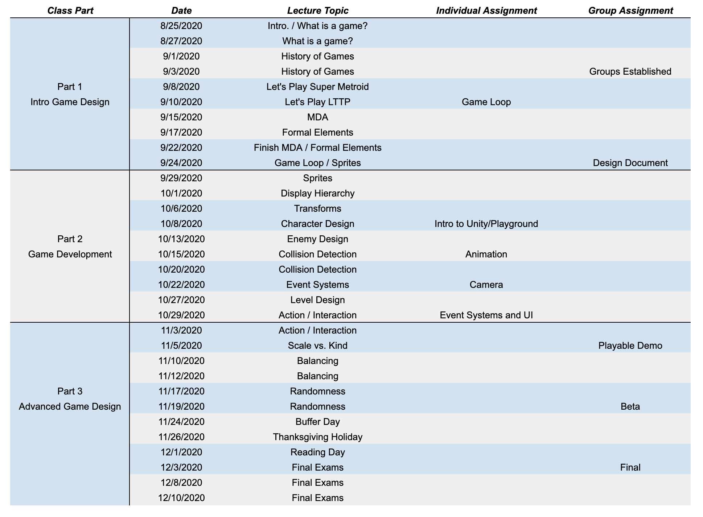

CS4730 - Game Design Course Logistics
===============================

[Back to course main page](../index.html)

Course Logistics
---------------------------------------

- [Introductory Slide Deck](../slides/00-courseIntro.pptx): This slide deck contains useful information about the course structure, grading policy, lab structure, etc. We will go over this on the first day of class.
- [Grading Policy](./grading.html): A summary of the somewhat non-conventional grading policy for this course.
- [Syllabus](./syllabus.html): Contains the same information as the slide deck above, but with more detail.

Course Schedule
---------------------------------------

{ width=80% }

Calendar
---------------------------------------

<iframe src="https://calendar.google.com/calendar/embed?src=o3s8k7dis44l1s4if2csbgta5g%40group.calendar.google.com&ctz=America%2FNew_York" style="border: 0" width="800" height="600" frameborder="0" scrolling="no"></iframe>

Teaching Assistants
---------------------------------------

- Graduate Student TAs:
	- Ryan Kann [rak3me@virginia.edu](mailto:rak3me@virginia.edu)

- Undergraduate TAs:
	- TBD

Office Hours
---------------------------------------

- TBD

